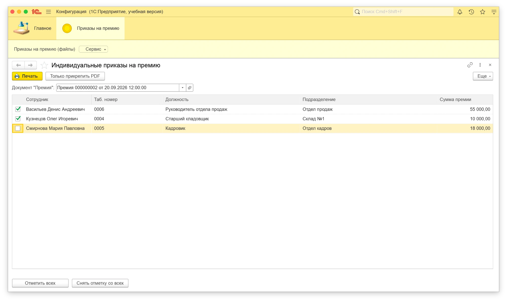
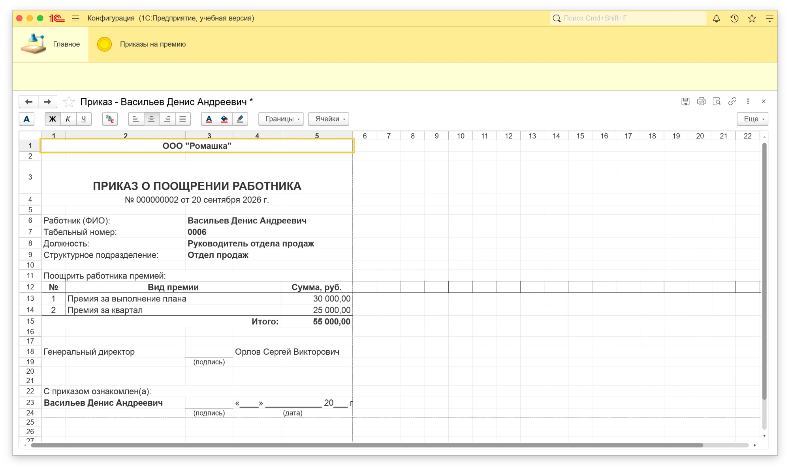
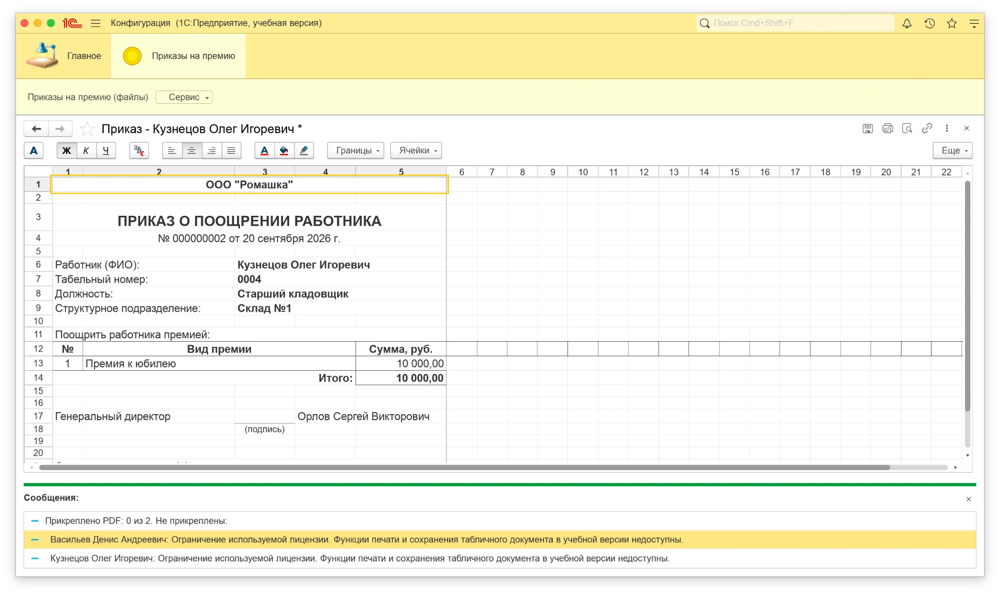

# Индивидуальные приказы на премию

Расширение `ТЗ_ПриказыНаПремию`: по проведенному документу "Премия" формирует **отдельный приказ на каждого отмеченного сотрудника** и прикрепляет каждый приказ к документу отдельным PDF.

## Окружение

| | |
|---|---|
| Платформа | 1С:Предприятие 8.3.27.1606 (учебная версия), тонкий клиент, управляемые формы |
| Конфигурация | демонстрационная конфигурация-стенд (`base/`), повторяющая нужную часть ЗУП 3.1: справочник "Сотрудники", документ "Премия", регистр "Кадровая история сотрудников", константы руководителя |
| Режим совместимости | 8.3.27 |

Базы ЗУП 3.1 у меня нет, поэтому расширение проверено на стенде. Как оно ложится на ЗУП - в разделе "Перенос на ЗУП 3.1".

## Состав репозитория

```
dist/ТЗ_ПриказыНаПремию.cfe       расширение
ext/                              выгрузка расширения в XML
base/                             выгрузка конфигурации-стенда
test/epf/                         обработка-автотест (исходники)
```

## Установка и где найти

1. Администрирование → Расширения конфигурации → Добавить из файла → `dist/ТЗ_ПриказыНаПремию.cfe`. Снять флажок "Безопасный режим" не требуется.
2. Перезапустить сеанс. Пользователю выдать роль `ТЗ_ОсновнаяРоль`.

Открыть функционал можно двумя способами:
- раздел **"Приказы на премию"** → "Индивидуальные приказы на премию";
- из формы документа "Премия": кнопка **"Индивидуальные приказы на премию"** - обработка откроется с уже выбранным документом.

Прикрепленные PDF открываются из формы документа "Премия": панель навигации → **"Приказы на премию (PDF)"**, команда "Открыть PDF".

## Как работает

1. Пользователь выбирает документ. В выбор попадают только проведенные и не помеченные на удаление (параметры выбора поля + повторная проверка в запросе).
2. Список сотрудников строится одним запросом: строки документа сворачиваются по сотруднику (`СУММА`, `СГРУППИРОВАТЬ ПО`), должность и подразделение берутся из среза последних кадрового регистра **на дату документа**. При смене документа список перестраивается.
3. "Отметить всех" / "Снять отметку со всех", отметка в любом порядке. Если никто не отмечен - предупреждение, на сервер ничего не уходит.
4. "Печать" - **один серверный вызов** на всю пачку. Сервер возвращает массив табличных документов, по одному на сотрудника; клиент открывает каждый в отдельном окне со своим ключом уникальности. Каждый можно отдельно распечатать и сохранить.
5. Каждый приказ пишется в PDF и прикрепляется к документу. "Только прикрепить PDF" делает то же без открытия форм.

## Архитектурные решения

- **Вся серверная логика - в модуле менеджера обработки** (`СотрудникиДокумента`, `СформироватьПриказы`). Форма только собирает отметки и показывает результат. Ту же функцию можно вызвать из любой другой точки (команда документа, регламент, тест).
- **Приказ на сотрудника - отдельный `ТабличныйДокумент`.** Отсюда сразу "N отмечено → N форм → N PDF" и гарантия, что в форме нет чужих данных: строки премии для каждого берутся отбором `НайтиСтроки` по индексированной таблице.
- **Без обращений через "точку" в цикле.** Все данные (шапка, сотрудники с кадровыми данными, строки премии) - тремя запросами до цикла; макет и его области получаются один раз. На 100+ сотрудников время растет линейно, без дополнительных запросов на сотрудника.
- **Права.** Во всех запросах `РАЗРЕШЕННЫЕ`; если документ недоступен пользователю, функция возвращает ошибку "недоступен по правам", а не данные.
- **Свой справочник `ТЗ_ПрисоединенныеФайлы`** (Документ, Сотрудник, Наименование = имя файла, ДанныеФайла в хранилище значения со сжатием). В стенде нет подсистемы присоединенных файлов БСП; в ЗУП файлы нужно класть в штатный `ПремияПрисоединенныеФайлы` через `РаботаСФайлами`, и они появятся "под скрепкой".

### Как исключены дубли файлов

Ключ файла - пара **"документ + сотрудник"**. Перед записью внутри транзакции ставится управляемая блокировка справочника, ищется существующий файл с этой парой: если найден - перезаписываются имя и данные, иначе создается новый. Повторная печать по тем же сотрудникам обновляет те же N файлов.

### Что происходит при ошибке прикрепления

Каждый файл пишется в **своей** транзакции. Если по сотруднику ошибка (не удалось сформировать PDF или записать файл):
- его транзакция откатывается - у документа остается предыдущая версия его файла (если была) или файла нет;
- остальные сотрудники обрабатываются, их файлы записаны;
- пользователь видит "Прикреплено PDF: X из N" и список сотрудников с причиной.

Печатные формы на экран открываются в любом случае.

## Имя файла

`Приказ №2 от 20.09.2026 - Васильев Денис Андреевич.pdf` - номер без ведущих нулей, дата документа, ФИО; недопустимые в именах файлов символы заменяются на `_`.

## Печатная форма

Собственный макет `ТЗ_ПриказОПоощрении`, А4 портрет, автомасштаб:
- шапка: организация, "ПРИКАЗ О ПООЩРЕНИИ РАБОТНИКА", номер и дата документа ("20 сентября 2026 г.");
- сотрудник: ФИО, табельный номер, должность, структурное подразделение - на дату документа;
- таблица видов премии с суммами в денежном формате и итогом (у сотрудника с несколькими строками - все строки);
- подпись руководителя (должность, ФИО - из констант стенда; в ЗУП - ответственные лица организации);
- "С приказом ознакомлен(а)" с ФИО сотрудника, местом для подписи и даты.

## Проверка

`test/epf` - обработка-автотест (запускается в базе со стендом):
- в списке документа №2 три сотрудника, Васильев с двумя строками премии - одной строкой, 55 000;
- у Васильева кадровые записи на 10.01, 01.09 и 01.10.2026; в приказе от 20.09 - "Руководитель отдела продаж", запись от 01.10 не подхватывается;
- отмечены Кузнецов (1-я строка документа) и Васильев (3-я и 4-я) - сформированы ровно 2 формы, в каждой только свой сотрудник;
- непроведенный документ: пустой список и ошибка при печати.

## Пример результата

Документ "Премия" №2, отмечены Васильев (3-я и 4-я строки документа) и Кузнецов (1-я строка), Смирнова не отмечена. Получены две отдельные печатные формы. Сообщение "Прикреплено PDF: 0 из 2" - ограничение учебной платформы (см. "Слабые стороны").







## Сильные стороны

- Ровно N отдельных форм и N файлов на N отмеченных, порядок отметки не влияет.
- Кадровые данные на дату документа, а не на текущую.
- Постоянное число запросов независимо от количества сотрудников, один серверный вызов на печать.
- Ошибка по одному сотруднику не ломает остальных; пользователь видит, по кому не получилось.
- Логика в модуле менеджера - ее можно вызывать без формы.

## Слабые стороны и что улучшил бы

- **Учебная платформа запрещает запись табличного документа в файл и в поток.** Поэтому PDF на стенде не создается, и обработка штатно выдает "не прикреплено" по каждому сотруднику. Формирование PDF, прикрепление и защита от дублей проверены только по коду; на полной платформе нужно прогнать вживую.
- Нет базы ЗУП: печать встроена отдельной обработкой, а не через подсистему печати БСП (`УправлениеПечатью`, `ДобавитьКомандыПечати`) - в ЗУП правильнее зарегистрировать печатную форму там, тогда она появится в штатном меню "Печать".
- Блокировка справочника файлов целиком: при массовой параллельной печати разных документов возможны ожидания. Лучше блокировать по полям "Документ, Сотрудник" (нужно задать поля блокировки данных).
- Номер приказа - номер документа "Премия"; если у каждого приказа должен быть свой номер, нужен нумератор.
- Тесты - обработка с логом, а не YAxUnit/Vanessa.

## Перенос на ЗУП 3.1

| Стенд | ЗУП 3.1 |
|---|---|
| `Документ.Премия.Сотрудники` (Сотрудник, ВидПремии, Сумма) | ТЧ `Начисления` (Сотрудник, Начисление, Результат) |
| `РегистрСведений.КадроваяИсторияСотрудников.СрезПоследних` | `КадровыйУчет.КадровыеДанныеСотрудников(..., "Должность, Подразделение", Дата)` |
| Константы руководителя | `ОтветственныеЛицаБЗК` / ответственные лица организации |
| `ТЗ_ПрисоединенныеФайлы` | `ПремияПрисоединенныеФайлы` через `РаботаСФайлами.ДобавитьФайл` |
| Обработка + команда документа | печатная форма через `УправлениеПечатью` |
